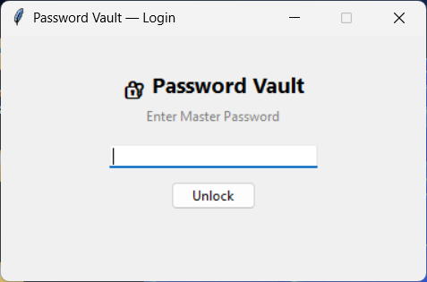
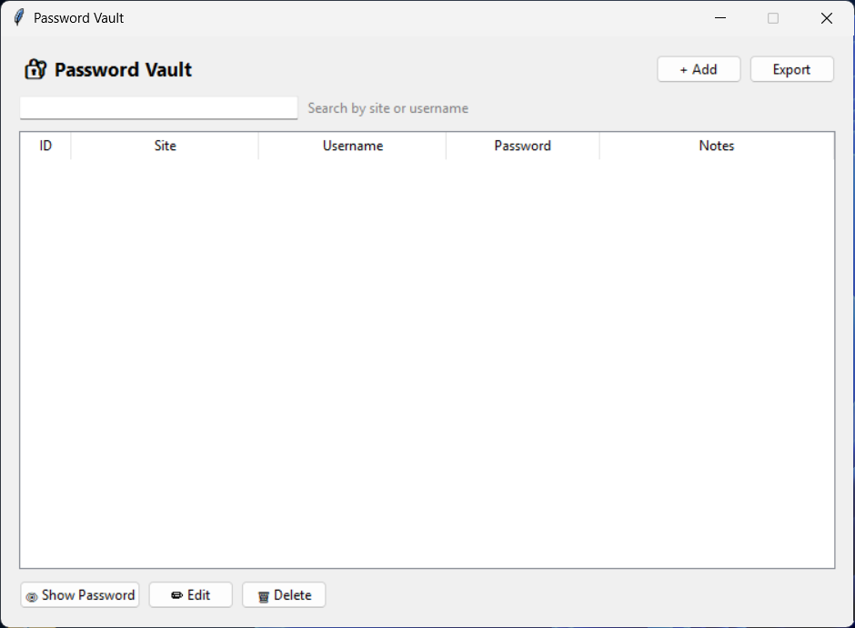

# Password Vault

A secure desktop password manager built with Python, using Fernet encryption for credentials and a hashed master password for access control.

## Features

- Master password protection (SHA-256 + salt)
- Add, edit, delete, and search credentials
- Passwords encrypted with Fernet before storage (never stored in plain text)
- Password generator (cryptographically secure, via `secrets`)
- Export vault to an encrypted `.txt` backup file
- SQLite local database
- Tkinter GUI with login screen

## Security

- **Credentials** are encrypted with Fernet (symmetric encryption) before being stored in SQLite
- **Master password** is never stored — only a salted SHA-256 hash is saved in `master.json`
- **Encryption key** is stored in `secret.key` — keep this file safe, without it your vault cannot be decrypted
- **Export file** is also Fernet-encrypted

## Architecture (MVC)

```
Password-Vault/
├── main.py                        # Entry point
├── model/
│   ├── credential.py              # Credential dataclass
│   └── database.py                # VaultDB — SQLite CRUD operations
├── view/
│   ├── login_view.py              # Master password screen
│   └── vault_view.py              # Main vault GUI
├── controller/
│   └── vault_controller.py        # Bridges View and Model
├── utils/
│   ├── crypto.py                  # CryptoManager — Fernet encrypt/decrypt
│   ├── auth.py                    # MasterAuth — master password hash/verify
│   └── generator.py               # PasswordGenerator — secure random passwords
└── tests/
    └── test_database.py           # Unit tests
```

## Requirements

```
cryptography
```

Install with:

```bash
pip install cryptography
```

## How to run

```bash
git clone https://github.com/TOMMMMMMMMMMMMP/Password-Vault.git
cd Password-Vault
pip install cryptography
python main.py
```

## First launch

On first launch you will be asked to create a master password. This password will be required every time you open the vault.

## How to use

| Action | How |
|--------|-----|
| Add credential | Click **+ Add**, fill in the form |
| Generate password | Click **⚡ Generate Password** in the form |
| View password | Select an entry → click **👁 Show Password** |
| Edit credential | Select an entry → click **✏ Edit** |
| Delete credential | Select an entry → click **🗑 Delete** |
| Search | Type in the search bar (filters by site or username) |
| Export backup | Click **Export** — creates an encrypted `.txt` file |

## Important files

| File | Description |
|------|-------------|
| `vault.db` | SQLite database (auto-generated) |
| `secret.key` | Fernet encryption key — **do not share or delete** |
| `master.json` | Hashed master password — **do not share** |

## Screenshots




## Running tests

```bash
python tests\test_database.py
```
